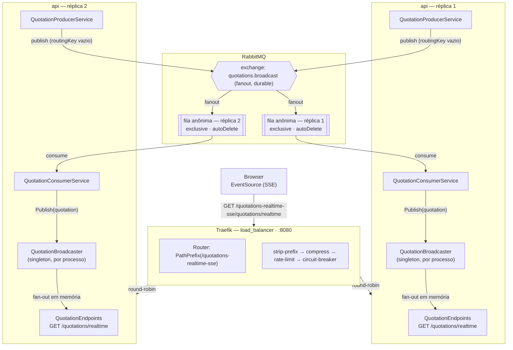

# Quotations Realtime (SSE)

API em .NET 10 que transmite cotações em tempo real para o browser via **Server-Sent Events**
(SSE nativo do ASP.NET Core, sem SignalR). As cotações são geradas por um producer e distribuídas
através do **RabbitMQ**, e o tráfego de entrada é balanceado por um **Traefik** na frente de duas
réplicas da API.

## Arquitetura



**Por que fanout em vez de fila compartilhada:** o `QuotationBroadcaster` vive em memória, isolado
por processo — cada réplica só sabe distribuir eventos aos clientes SSE conectados a ela mesma. Se
as duas réplicas consumissem a **mesma fila nomeada**, o RabbitMQ dividiria as mensagens entre elas
(competing consumers) e cada cliente veria só uma fatia do stream. Com uma exchange `fanout` e uma
fila exclusiva por réplica, toda mensagem publicada é copiada para todas as réplicas vivas, então
qualquer cliente SSE vê o mesmo stream completo, não importa a qual réplica o Traefik o conectou.

## Estrutura do projeto

```
Quotations.Realtime.Api/
├── Api.csproj
├── Dockerfile
├── docker-compose.yml
├── appsettings.json
├── Configurations/RabbitMqOptions.cs
├── Endpoints/QuotationEndpoints.cs      # endpoint SSE
├── Models/Quotation.cs                  # payload trafegado
├── Services/Quotations/
│   ├── QuotationBroadcaster.cs          # fan-out em memória para os clientes SSE
│   ├── QuotationProducerService.cs      # gera cotações fake e publica no RabbitMQ
│   └── QuotationConsumerService.cs      # consome do RabbitMQ e alimenta o broadcaster
└── Program.cs
ui/
└── index.html                           # frontend estático de demonstração
```

## Pré-requisitos

- [.NET 10 SDK](https://dotnet.microsoft.com/) (para rodar localmente sem Docker)
- Docker + Docker Compose (para subir o stack completo)
- Um RabbitMQ acessível (local, container avulso ou remoto)

## Configuração

As opções do RabbitMQ ficam em `Quotations.Realtime.Api/appsettings.json`, seção `RabbitMq`, e
podem ser sobrescritas por variáveis de ambiente (`RabbitMq__HostName`, etc.) sem editar o arquivo:

| Chave          | Descrição                                              | Valor de exemplo       |
|----------------|---------------------------------------------------------|-------------------------|
| `HostName`     | Host do broker RabbitMQ                                 | `10.0.0.150`            |
| `VirtualHost`  | Virtual host usado                                       | `quotation`             |
| `ExchangeName` | Exchange `fanout` onde as cotações são publicadas        | `quotations.broadcast`  |
| `UserName`     | Usuário do RabbitMQ                                      | `guest`                 |
| `Password`     | Senha do RabbitMQ                                        | `guest`                 |

> O `appsettings.json` do repositório traz um host interno e as credenciais padrão do RabbitMQ
> apenas para desenvolvimento local. Ajuste via variável de ambiente para outros ambientes.

## Como subir

### Opção A — Docker Compose (Traefik + 2 réplicas da API)

```bash
cd Quotations.Realtime.Api
docker compose up --build -d
docker compose ps
```

Isso sobe:
- `loadbalancer` (Traefik) expondo `http://localhost:8080`, roteando `PathPrefix(/quotations-realtime-sse)` para o serviço `api`;
- `api` com 2 réplicas (`deploy.replicas: 2`), cada uma conectando ao RabbitMQ configurado em `appsettings.json`/variáveis de ambiente.

> **Atenção:** o healthcheck do serviço `api` no `docker-compose.yml` aponta para
> `/health/live?source=docker`, mas a aplicação só expõe `/health` (ver `Program.cs`). Enquanto
> essa divergência não for corrigida, o container `api` não atinge o estado `healthy` e o
> `loadbalancer` — que depende de `api: condition: service_healthy` — não chega a subir. Ajuste o
> `test:` do healthcheck para `/health` (mesmo caminho já usado no label do Traefik) antes de usar
> em qualquer ambiente real.

### Opção B — Localmente com `dotnet run` (uma única instância)

```bash
cd Quotations.Realtime.Api
dotnet run
```

Sobe em `http://localhost:7000` (perfil `http` de `Properties/launchSettings.json`), sem Traefik e
sem múltiplas réplicas — útil para desenvolvimento e depuração.

## Como usar

Abra `ui/index.html` diretamente no browser. Ele conecta via `EventSource` em:

```
http://localhost:8080/quotations-realtime-sse/quotations/realtime
```

(URL fixa, presumindo o stack subido pela Opção A). Cada cotação recebida atualiza um card por
`tickerId` na tela.

Se estiver rodando pela Opção B (sem Traefik), ajuste a URL no `ui/index.html` para
`http://localhost:7000/quotations/realtime`.

## Como chamar a API diretamente

O endpoint expõe um stream SSE nomeado `quotations`:

```
GET /quotations/realtime            # direto na API (Opção B)
GET /quotations-realtime-sse/quotations/realtime   # através do Traefik (Opção A)
```

Cada evento traz um JSON no formato:

```json
{ "tickerId": "PETR4", "value": 4.32 }
```

**Via curl** (mantém a conexão aberta e imprime cada evento conforme chega):

```bash
curl -N http://localhost:8080/quotations-realtime-sse/quotations/realtime
```

**Via JavaScript**:

```js
const eventSource = new EventSource(
  "http://localhost:8080/quotations-realtime-sse/quotations/realtime"
);

eventSource.addEventListener("quotations", (event) => {
  const { tickerId, value } = JSON.parse(event.data);
  console.log(tickerId, value);
});
```